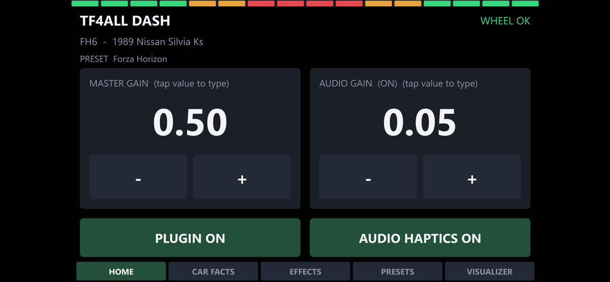

# Trueforce For All

**Everything your Logitech wheel can do, in games that never supported it.**
Trueforce, rev lights, the screen.

> **Two channels.** Stable builds are the ones marked "Latest" on the
> [releases page][releases]. The beta channel runs ahead of them and is open
> to anyone: install the newest build marked "Pre-release" and the in-app
> updater keeps you on that channel from then on. Anything marked _Beta_
> below is in the beta channel and has not reached stable yet.
> Something not working? Please [open an issue][issues] or say so in the
> [Discord][discord].

Official Trueforce support keeps growing, but many major titles are still
waiting and some will never get it. This plugin fills those gaps, building
the haptics from telemetry or from the game's own audio.

Original Windows code, built on a wire protocol reverse-engineered by the
[mescon Linux driver project][mescon] and, for the wheel's OLED screen, on
protocol work by [PeposCJ][logidynamicdash]. No Logitech source, firmware or
assets are used or redistributed.

## Supported wheels

| Wheel | Haptics + FFB | Rev lights | OLED screen |
|---|---|---|---|
| Logitech G PRO Racing Wheel (Xbox/PC and PS/PC) | Yes | Yes | Yes |
| Logitech RS50 | Yes | Yes | Yes |
| Logitech G923 (Xbox/PC and PS/PC) | Yes | Yes | No screen |

Rev lights and the OLED screen are _Beta_ features, and both need
[Telemetry Based FFB](#telemetry-based-ffb) switched on. They share a control
channel with the wheel's force, so they can only run when the plugin is
generating that force itself.

The G923 is a quieter gear-driven wheel than the G PRO and RS50, so if it
feels light, raise master or Trueforce gain.

## What it does

The plugin runs inside SimHub and drives the wheel's Trueforce haptic motor
in real time. Everything rides on top of your real force feedback, which it
preserves via FFB pass-through. It mixes:

- **FFB pass-through (the foundation).** Driving the Trueforce motor would
  otherwise silence the game's own force feedback, so the plugin taps that
  signal off the USB bus and folds it back into the Trueforce stream. Your
  real cornering load, weight transfer and curb forces keep coming through
  underneath every effect below, in any game whose force feedback uses
  standard HID++ (effectively all of them on these wheels).

- **Telemetry-derived effects** synthesized from live game data.

  - **Engine pulse**: rumble at the engine's firing pattern, derived
    from RPM and cylinder count (auto-detected per car when possible).
    Idle gives a gentle hum; higher RPM lifts both pitch and intensity.
  - **Gear shift**: a short low-frequency thud whenever the gear changes.
  - **ABS click**: configurable haptic when ABS engages.
  - **Pit limiter**: configurable pulsing buzz while the limiter is
    engaged.
  - **Redline buzz**: a hard buzz when you enter the redline. On by
    default.
  - **DRS**: short chirp on the rising edge when the wing opens, plus an
    optional sustained flutter while DRS stays active. Silent on games
    that don't expose the flag.
  - **Road bumps**: triggered by vertical acceleration so rough terrain
    rumbles through the wheel. On Forza, the per-tire surface-rumble
    field is read directly for a richer, more accurate continuous road
    feel on top of the heave channel.
  - **Implement thud** _(Beta)_: lower, raise or extend an implement, or
    work a loader or crane arm yourself, and you feel the hydraulic hum
    while it moves and the thump as it lands. (Farming Simulator.)
  - **Traction loss**: tire-screech haptics when grip breaks (wheelspin,
    lockup, drift). Read directly from per-wheel slip in games that
    expose it (AC and the Forza titles), weighing each tire by load so
    it reflects how much of the car is actually losing grip; inferred on
    the SimHub universal path from wheel-vs-ground speed plus a
    yaw-rate / lateral-G discrepancy check. In Farming Simulator, Axle
    slip covers this instead.
  - **Axle slip** _(Beta)_: understeer and oversteer as two distinct
    feelings instead of one blur: a high scrub texture as the front washes
    wide, a deeper pulse as the rear steps out. (Per-tire telemetry: the
    Forza titles, Assetto Corsa and Farming Simulator.)
  - **Lockup judder** _(Beta)_: when a wheel locks under braking, a coarse
    pulsing judder kicks in, the feel of a flat-spotted tire skidding
    rather than rolling, fading as the car slows. A locked wheel becomes
    something you feel and can correct instead of a silent loss of grip.
    (Per-tire telemetry: the Forza titles and Assetto Corsa.)
  - **Collision**: amplitude-scaled thud on impact, with a soft-knee
    curve so harder hits feel stronger without becoming unsafe, plus a
    refractory window so multi-frame crashes don't stutter.
  - **Airborne ducking**: when the car leaves the ground, the chosen
    effects cut out so jumps feel weightless, then return on landing.
    Detected from wheel load / suspension (AC, the Forza titles and
    Farming Simulator). On by default.
  - **Stationary spring**: centering force so a parked or crawling car
    has some weight at the wheel instead of going limp, fading out as
    speed builds (AC).
  - **And more**, with the set still growing. Which effects a game can
    drive depends on the telemetry it publishes, so the plugin shows you
    the ones your current game supports and hides the rest.

- **Audio-derived effects**: WASAPI loopback captures the game's
  audio output (engine, tire, impact sounds) and feeds it into the
  wheel as low-latency haptics. Lets you feel things the telemetry
  doesn't expose, and works even for games which do not output telemetry data
  since capture targets the game process directly.

All of it is configurable per-game, per-car, from the plugin's panel inside
SimHub: master gain, individual effect tuning, sidechain ducking between
continuous and transient effects, and a savable preset library. The tabbed
layout, typed values on every slider, and community sharing in the preset
library are _Beta_.

_Beta._ Four pairs of controls can be bound to anything SimHub can see, a
wheel button, a button box, a keyboard key, so the things worth changing
mid-stint do not cost you a hand: Trueforce gain up and down, Telemetry
Based FFB strength up and down, the wheel's screen forward and back, and
dash tabs forward and back. The two gain controls report their new value
on the dash and on the wheel's screen at the same time.

## Telemetry Based FFB

_Beta._

In supported games the plugin builds the entire steering force itself,
instead of passing the game's own force feedback through. Today that means
the Forza titles (Forza Motorsport and Forza Horizon 4, 5, and 6) and
Farming Simulator 22 and 25. Support is planned for more titles over time.

In Forza you get a real sense of the grip limit: the wheel goes light as
the front washes wide, loads up through a corner, and pulls into a
countersteer as the rear steps out. Farming Simulator gets a model built
for heavy machinery instead: see [Farming Simulator](#farming-simulator).

It tunes itself as you drive, and the optional **Auto strength** levels
cars out so you stop retuning at every swap. (Forza only.)

In the Forza titles it can replace the game's force feedback wholesale, so
it is **off by default**. Farming Simulator is the other way round: there it
is the only thing making real force feedback, so it **arms itself** as
soon as the game is running. Still being dialed in, so feedback on how it
feels is welcome.

**It also unlocks the wheel's lights and its screen.** The rev lights fill
and flash with the engine, honoring the car's real redline where the
community has confirmed one, and on a G PRO or RS50 the OLED screen comes
to life (below). Both share a control channel with the game's force
feedback, so they can only run while the plugin is generating that force
itself. (A custom driver that lifts this restriction in every game is in
progress; Microsoft has to sign it before it can ship.)

## The wheel's OLED screen

_Beta._

The G PRO and RS50 have a small display in the middle of the wheel. The
plugin takes it over, and you choose what goes on it.

- **Eleven ready-made screens.** Speed over gear and gear over speed,
  captioned or not; speed alone or gear alone; a big gear with the speed
  beside it, and the reverse; and three that carry your lap delta.
- **Or build your own.** Pick a layout, then choose what goes in each
  slot: gear, speed, lap delta, position, lap of total, last lap time, or
  your own text. The editor gives each slot's size and character limit,
  and shows the screen on the wheel as you build it.
- **It reacts as you drive.** Shift and it flashes the gear, unless your
  screen already shows it. Cross the line and it puts up the lap time with
  your delta underneath, and tells you when it was a personal best.
- **It reports changes as they happen**, like a preset loading or a gain
  you just nudged, and warns you if the game is still sending its own
  force feedback.

Bind a button to step through your screens without letting go of the
wheel. Like the rev lights, the screen needs
[Telemetry Based FFB](#telemetry-based-ffb).

## Farming Simulator

_Beta._

Farming Simulator 22 and 25 normally drive the wheel with one basic
centering spring. Every machine feels the same, and none of the ground
you are driving over comes through the wheel. Telemetry Based FFB builds
the force from the game's own telemetry instead: the ground under the
tires, the weight of the machine as it turns, and an implement dragging
harder as it fills.

**The TF4ALL Enhanced Telemetry mod comes with it.** The game does not
publish enough telemetry on its own, so the plugin installs a mod that
reports implement state, fill and mass, hydraulic motion and wheel
speed. It finds your mods folder even if you have moved it. Leave
SimHub's own Telemetry Interface mod in place alongside it; this one
adds a channel rather than replacing it.

**Baked-in engine data for all 153 Farming Simulator 25 base-game
vehicles**, so the engine effects know what they are driving without
being told. Vehicle names come from the game itself, through the mod.

## FFB spike reduction

Some games (Assetto Corsa being the worst offender we've seen) deliver
curb and collision FFB spikes wildly out of proportion to what's safe or
comfortable. On a strong wheelbase they can ruin a racing line or cause
real wrist strain over a session. iRacing has a built-in softener; most
other games don't. The plugin taps the game's outgoing FFB on the USB
bus and attenuates spikes only, so curbs land as confident pushes
instead of yanks while sustained cornering load and weight transfer
pass through untouched. Useful on its own, even with all our other
effects turned off.

## TF4ALL Dash

_Beta._

The plugin ships its own SimHub dashboard, made for a phone or tablet
kept next to you or mounted on the rig: something to read while you
drive, and a way to change things mid-session without alt-tabbing out of
the game.

- Drive tab: a race-ready view. Gear, speed and revs in the middle with
  pedals and steering around them, and the rest of the screen is boxes
  you arrange yourself. Keep one layout for everything, or a different
  one per game.
- Set a car's name, redline start or engine type.
- Turn individual effects on and off and set their gain.
- Adjust master and audio capture gain.
- Switch presets.
- On-screen rev lights across the top of every screen, the dash's own
  strip rather than the wheel's. Fill left to right or outside in, your
  pick in Settings.
- Visualizer: scrolling waveforms of the game's steering force and the
  haptic layer, as sent to the wheel. Clipping turns the trace red, and
  a yellow SPIKE badge marks where spike reduction stepped in.
- Telemetry Based FFB: turn it on or off for the game you are in, and
  tune its main knobs from the rig. Tap any value to type an exact
  number instead of stepping to it.
- Idle mode: go idle or close the game and the dash becomes an ambient
  card, your name and number over moving artwork, with the plugin
  version and any waiting update along the foot. Ten backgrounds, and
  you set how long it waits before dropping into idle.
- Themes: eight palettes, applied to the running dash without a reload.
  Colors that carry meaning, like a red warning or a green best lap, are
  left alone.
- Make it yours: hide the tabs you don't use and reorder the rest, in
  Settings > TF4ALL Dash.

Installs with the plugin and appears in SimHub's dashboard list.

## Community features

_Beta. The Discord server below is open to everyone._

Once one driver figures out a car's redline, fixes its name, or picks
its engine layout, everyone driving that same car gets it automatically.
Community features are on by default and anonymous: car facts need no
account. Turn them off in Settings and the plugin works fully offline
(see [Privacy](#privacy)).

- **Community preset browser**, built into the Presets tab. Browse what
  other drivers have shared for any game or car, sorted by votes and
  downloads, and download one to try it.
- **Share your own.** Game presets, car presets, custom engines, and
  multi-preset packs can all be shared, with a description attached.
- **Car facts flow back automatically.** Correct a redline, fix a car's
  name, or pick an engine layout, and the fact is shared anonymously.
  The next driver loading the same car gets the correction applied
  without ever opening a panel. Sharing follows your community
  settings and can be turned off.
- **Downloaded presets stay current.** When a curator updates a preset
  you downloaded, an "updates available" chip surfaces it; apply updates
  manually or automatically.
- **No account needed; sign-in adds extras.** Car facts work
  anonymously; an optional sign-in (an emailed one-time code, no
  password) unlocks preset sharing and the Account tab, where you can
  set a display name, see how your shared presets are doing, export
  your data, or delete your account.

No single bad submission wins out: presets are surfaced by votes, and
car facts converge as more drivers submit agreeing values.

There is also a **[Discord server][discord]**: a place to hang out, swap
tunes, ask for help, and get involved. Link your Discord account in the
plugin and the achievements you earn for contributing (sharing presets,
getting downloads, submitting car facts other drivers end up using)
grant matching roles in the server.

The plugin is in active development and functional today. Feedback is
welcome there, or on [GitHub issues][issues].

## Supporting the project

The plugin is free and stays that way. For anyone who wants to support
it, there is a **[Patreon][patreon]**. It covers the real costs behind
the project: hosting for the community backend, the code-signing
certificate for the upcoming driver, and the time that goes into
building all this. As a thank-you, supporters get cross-device backup
and sync of their full setup (sign in on another PC and your tuning
rides with you) and a spot on the supporters wall in the plugin.
Manual export/import stays available to everyone.

## Install

The easiest path is the bundled installer:

1. Download `TrueforceForAll-Setup.exe` from the [releases page][releases].
   The build marked "Latest" is stable. For anything marked _Beta_ in this
   README, take the newest build marked "Pre-release" instead; the in-app
   updater then keeps you on that channel.
2. Close SimHub if it's running.
3. Run the installer. It detects SimHub, copies the plugin files into the
   SimHub install folder, and (if USBPcap isn't already installed) runs
   the bundled USBPcap setup automatically.
4. Close Logitech G HUB (it claims the wheel's HID interface).
5. Launch SimHub. The plugin auto-enables on first run.

The installer is conservative on uninstall: it removes our files but leaves
SimHub, USBPcap, and shared dependencies (HidSharp, NAudio) alone, so other
plugins that share those keep working.

## Requirements

- Windows 10 / 11
- [SimHub](https://www.simhubdash.com/)
- A supported Logitech wheel (table above)
- [USBPcap](https://github.com/desowin/usbpcap), bundled with our installer
  if you don't already have it. Used to mirror the game's existing FFB
  signal into the Trueforce stream so the two coexist.
- Logitech G HUB **closed** while playing (it claims the HID interface and
  blocks us from talking to the wheel)
- **SimHub running as administrator.** Reading the wheel's USB traffic needs
  it, so without it the force feedback pass-through never starts. Turn on
  Run as administrator in SimHub's own settings, then restart SimHub.

## Per-game enhancements

A few titles are read directly rather than through SimHub, at a much
higher rate than SimHub's 60 Hz cap. That makes their effects sharper and
more responsive, and it needs no SimHub license:

**Assetto Corsa** has a dedicated path: shared memory is read directly at
AC's native 333 Hz physics rate (polled at 1 kHz so events are seen within
1 ms of being written). The higher rate makes curb collisions, road-bumps,
traction-loss and other haptic effects noticeably sharper and more
responsive than SimHub's 60 Hz feed can deliver.

**Forza Horizon 4, 5, and 6, plus Forza Motorsport** _(Motorsport is Beta)_
also have a direct UDP Data Out reader that picks up per-tire fields for the
surface-texture, curb-strike and collision effects, and feeds
[Telemetry Based FFB](#telemetry-based-ffb). The Horizon games send this
telemetry once per rendered frame, so it tracks your frame rate (often
well above 60 Hz), giving more depth in surface detail effects than some
other titles offer. All four are auto-detected from SimHub's game
profile.

**Farming Simulator 22 and 25** _(Beta)_ are read through the TF4ALL
Enhanced Telemetry mod the plugin installs for you, at up to 100 Hz. The game
publishes almost nothing on its own, so the mod is what makes
[Farming Simulator](#farming-simulator) force feedback possible at all.

Additional direct-read titles will be added over time.

Every other SimHub-supported game runs through SimHub's universal telemetry
feed instead. The plugin works there without a SimHub license, but
unlicensed that feed is capped at 10 Hz, which makes the effects feel coarse.
A licensed copy of SimHub (a small one-time payment) lifts it to 60 Hz, a
big step up in feel.

### Forza UDP setup

In Forza Horizon 4/5/6, open Settings → HUD and Gameplay → UDP RACE
TELEMETRY. In Forza Motorsport the same settings live under Settings →
Gameplay & HUD. Turn DATA OUT ON, set DATA OUT IP ADDRESS to `127.0.0.1`,
and set DATA OUT IP PORT to match the plugin's Port field in the Forza
section (`5300` by default). That is the whole setup.

#### Also forwarding to SimHub (dashboards, bass shakers, Buttkicker)

This plugin passes a copy of Forza's telemetry on to SimHub, so anything
SimHub drives (dashboards, ShakeIt bass shakers, a Buttkicker, arduino
devices) keeps working too. You have already pointed Forza at the plugin
in the setup above; this just adds the relay to SimHub. In the Forza
section of the plugin settings:

1. In SimHub, click the Home button at the top of the left sidebar. It
   should show Forza Horizon as the active game (if not, click Change
   game). Open Game config and note the UDP port it shows (often 8000).
   You are only reading this number here, so do not change anything.
2. Enable "Also forward to SimHub", set the forward host to `127.0.0.1`,
   and set the forward port to that SimHub port.
3. Drive for a moment and check the "Forwarded:" line in that section.
   Once it shows packets, SimHub's dashboards and bass shakers are back.

The result is `Forza → this plugin → SimHub`, so haptics from this plugin
and everything SimHub drives both work at the same time.

## Games with native Trueforce

Some titles already ship Trueforce on PC, so the plugin defaults itself
**off** for them. Switch off the game's native Trueforce and you can run
the plugin instead, tuning the feel yourself rather than taking whatever
the game hardcodes (and on Automobilista 2, adding Trueforce that was never
really there).

The catch: **a slider at 0 is not off.** Many games keep the Trueforce API
live even at 0, so the plugin fights a channel the game is still driving and
the wheel whines. Only a real on/off switch or a config-file setting fully
releases the wheel.

| Game | How to disable native Trueforce | Plugin takes over? |
|---|---|---|
| iRacing | Set `loadTrueForceAPI=0` in `app.ini` | Yes |
| Dirt Rally 2.0 | In-game Trueforce on/off switch | Yes |
| GRID (2019) | In-game Trueforce on/off switch | Yes |
| Forza Motorsport (2023) | Not tested | Yes, through [Telemetry Based FFB](#telemetry-based-ffb). Enable the plugin for the game first |
| Automobilista 2 | Steam launch option `disableTF` (try `-disableTF` if that fails) | Likely, untested |
| Assetto Corsa Competizione | Slider only, no off switch found | No, stays live |
| Assetto Corsa EVO | Slider only, no off switch found | No, stays live |
| Assetto Corsa Rally | Slider only, no off switch found | No, stays live |
| BeamNG.drive | Not tested | Not tested |
| F1 22, 23, 24 and 25 | Not tested | Not tested |
| EA Sports WRC (2023) | Not tested | Not tested |
| WRC 10 | Not tested | Not tested |
| WRC Generations | Not tested | Not tested |
| Project CARS 3 | Not tested | Not tested |
| Test Drive Unlimited Solar Crown | Not tested | Not tested |
| Le Mans Ultimate | Not tested | Not tested |

**AMS2 is a special case:** per Reiza's devs it loads the Logitech SDK but
never actually implements Trueforce, so it behaves like a non-Trueforce
game with the channel left live. The `disableTF`
launch option falls back to legacy mode and should let the plugin take
over, but I haven't confirmed it on hardware. (Steam launch options: right-
click the game, Properties, General, Launch Options.)

>I don't own some of these titles, so this table grows from user reports. If
you find an off switch or config setting for one of the ones still marked
"no", or get the plugin working on a native-Trueforce game that isn't listed
here at all, please open an issue and let me know.

## Auto-discovery

 On startup the plugin:

1. Enumerates connected HID devices, finds the wheel's Trueforce interface
   (`MI_02`, vendor usage page `0xFFFD`).
2. Enumerates USBPcap interfaces and parses injected device descriptors to
   find which root hub the wheel is on and what USB address the OS assigned
   it this boot.
3. Starts the FFB tap and Trueforce stream automatically.

If the wheel isn't detected (G HUB still running, USBPcap not installed,
wheel unplugged) the plugin logs a clear status message and disables itself
gracefully.

## Known limitations

- **Logitech G HUB must stay closed** the entire time the plugin is in
  use, not just at launch. G HUB claims the wheel's HID interface and
  blocks us from talking to it. If G HUB is opened mid-session, close
  it and reload the SimHub plugin to reattach.
- **The Trueforce level dial on the wheel doesn't apply** while this
  plugin is driving Trueforce. Once we take over the ep3 stream, the
  wheel's own Trueforce intensity scaling stops responding to the dial.
  Use the in-plugin Master Gain and per-effect Gain controls to set
  intensity instead.

## FAQ

**Which games does it work with?**
The audio-derived effects work in any game at all, since the plugin captures
the game's audio directly with no SimHub support needed. Games that SimHub
supports additionally get the telemetry-derived effects (engine pulse, gear
shifts, ABS, and so on). Assetto Corsa, Forza Motorsport, the Forza
Horizon games and Farming Simulator go further with a higher-fidelity
direct path (see Per-game enhancements).

**Do I need to pay for SimHub?**
SimHub itself is free, and the plugin works without a SimHub license. The
difference is the telemetry rate: unlicensed, games the plugin doesn't read
directly run at only 10 Hz, which makes the effects feel coarse. A licensed
copy lifts that to 60 Hz, which is a big step up in feel. SimHub is cheap and
well worth it. (Assetto Corsa, the Forza titles and Farming Simulator are
read directly, so they run at their full rate regardless of license.)

**Is this anti-cheat safe?**
Yes. The plugin operates entirely outside the game. It never injects code,
reads or modifies game memory, or hooks the game in any way. It only talks
to the wheel over USB (via USBPcap), reads telemetry the game already
broadcasts (SimHub, shared memory, or UDP), and captures game audio through
Windows' own loopback. Switching off a game's native Trueforce is done by
editing a config file or flipping an in-game setting before launch, never by
touching the running game.

**Will it change or replace my normal force feedback?**
Not unless you ask it to. By default the plugin preserves your existing
force feedback and layers haptic effects on top of it; your wheelbase's own
FFB still comes through, with all your usual settings intact. The exception
is [Telemetry Based FFB](#telemetry-based-ffb), which deliberately builds
the steering force from telemetry instead. In the Forza titles that is
opt-in and stays off until you turn it on. In Farming Simulator it runs
automatically, because the centering spring it replaces is all the game
offers.

**Why does it need USBPcap, and is that safe?**
USBPcap is an open-source USB capture driver. The plugin uses it to read the
wheel's own force-feedback traffic off the USB bus so it can mirror that into
the Trueforce stream (this is the FFB pass-through that keeps your normal
force feedback alive). It only looks at the wheel's traffic, it's widely used
and bundled with our installer, and you can uninstall it separately at any
time.

**Do I need Logitech G HUB?**
Some wheels need G HUB launched once to switch into PC mode and expose their
full HID interfaces. If the wheel isn't detected, open G HUB once, let it
recognize the wheel, then close it completely before launching SimHub. G HUB
claims the wheel's HID interface, so it must stay closed while you play. The
wheel can drop out of PC mode after a PC restart or when you unplug it, so
you may need to repeat the open-once-then-close step after each reboot.

**My normal force feedback disappeared, or the plugin says pass-through
is not running.**
Check that SimHub is running as administrator. Reading the wheel's USB
traffic needs it, and without it the pass-through cannot start. Use
SimHub's own Run as administrator setting rather than right-clicking the
exe, then restart SimHub.

**The effects feel weak or light.**
Raise Master Gain and the per-effect Gain in the plugin settings. The
Trueforce dial on the wheel itself does nothing while the plugin is running,
so all intensity is set in the plugin. The G923 is a quieter gear-driven
wheel and usually needs more gain than the G PRO or RS50.

**Can I use this in games that already support Trueforce?**
By default the plugin stays off for native-Trueforce titles, since the game
already provides it. But you can switch off the game's native Trueforce and
run the plugin instead, which lets you tune the feel yourself. See
[Games with native Trueforce](#games-with-native-trueforce) for which titles
allow this and how.

## Community coverage

- **Overtake.gg**, [Logitech's Trueforce Arrives Early in Forza Horizon 6 Thanks to Community-Made SimHub Plugin](https://www.overtake.gg/news/logitechs-trueforce-arrives-early-in-forza-horizon-6-thanks-to-community-made-simhub-plugin.4520/): Detailed news writeup of the plugin bringing Trueforce to Forza Horizon 6 at launch, ahead of any native support from the game.
- **Armando Ramirez**, [Does Logitech TRUEFORCE Actually Matter in Forza Horizon 6?](https://www.youtube.com/watch?v=p5P_Ww14CNg): The first video walkthrough of the plugin in Forza Horizon 6, including custom presets the creator tuned.
- **Revasio**, [French installation tutorial on TikTok](https://www.tiktok.com/@revasio/video/7641185174306180384): A walkthrough of installing and setting up the plugin, narrated in French.

## How it works

The wire protocol (init sequence and ep3 streaming format) was
reverse-engineered by the [mescon Linux driver project][mescon]. This
repo is the Windows-side glue on top of that: a SimHub plugin that opens
the wheel, synthesizes the telemetry/audio-derived effects, handles
per-game tuning, and runs the USBPcap-based FFB tap that mirrors the
game's HID++ output into bytes 6-9 of the Trueforce ep3 stream. That
mechanism (bytes 6-9 as the motor torque target, the rolling window as
an additive overlay on top) has since been independently confirmed by
the mescon driver's own implementation on RS50 hardware.

## Privacy

Community features are on by default and anonymous; turn them off in
Settings and the plugin runs fully offline. What the online features
(community presets, car data, sign-in, cloud backup) store, who
processes it, and how to export or delete it is covered in
[PRIVACY.md](PRIVACY.md).

## License

GPL-2.0-only. See [LICENSE](LICENSE).

The wire protocol and init sequence are derived from the
[mescon Linux driver project][mescon], also GPL-2.0.

## Acknowledgments

- **[mescon/logitech-rs50-linux-driver][mescon]**: reverse-engineered
  the wheel's driver and wire protocol. This project would not exist
  without their work.
- **[PeposCJ/LogiDynamicDash][logidynamicdash]**: worked out how the wheel
  base's OLED screen is driven and documented it publicly. The wheel screen
  support here is built on that work.
- **Andrew Boersma**: built the telemetry-based force feedback engine
  and the axle slip, curb thump, and lockup judder effects. The headline
  features of the 0.2.0 release are his work.
- **[USBPcap][usbpcap]** by Tomasz Mon: the kernel-mode USB filter that
  lets us tap the wheel's bus traffic for FFB pass-through.
- **[mdjarv/assettocorsasharedmemory][acshmem]**: community reference
  for AC's shared-memory layout, used to validate our SPageFilePhysics
  field offsets.
- **[HidSharp][hidsharp]**: cross-platform HID library used for the
  control-side of wheel communication.
- **[NAudio][naudio]**: audio I/O library used for the per-process
  loopback capture pipeline.
- **[ManteoMax's Forza Horizon 5 spreadsheet][manteomax]**: the
  canonical community catalog mapping Forza CarOrdinal to year/make/model
  and engine specs. Our FH5 lookup (engine cylinder / layout / electric
  detection plus auto-named per-car presets) is built from this data.
- **[SimHub][simhub]**: the host application. This plugin is unofficial
  and not affiliated with the SimHub project.
- **Armando Ramirez**: produced a [video walkthrough][armando] of the
  plugin in Forza Horizon 6 and tuned his own presets for it.
- **Revasio**: produced a [French-language installation tutorial][revasio]
  on TikTok, helping French-speaking drivers get set up.
- **Caleb Pearson**: reported that the plugin was not working on the
  RS50, exported the TF4ALL logs that helped pinpoint the cause, and
  validated the fix on his hardware. Without his report the RS50 issue
  would have gone unnoticed. He also discovered and confirmed that the
  plugin brings Trueforce back to iRacing when running MAIRA.
- **Svenmoor**: tested the plugin against a range of native-Trueforce
  titles and mapped which ones have a true Trueforce off switch (so the
  plugin can take over cleanly) versus which only expose an intensity
  slider, which populated the "Games with native Trueforce" table above.

Logitech, Trueforce, G PRO, RS50, and G923 are trademarks of Logitech.
This project is not affiliated with, endorsed by, or sponsored by Logitech.

[mescon]: https://github.com/mescon/logitech-rs50-linux-driver
[logidynamicdash]: https://github.com/PeposCJ/LogiDynamicDash
[usbpcap]: https://github.com/desowin/usbpcap
[acshmem]: https://github.com/mdjarv/assettocorsasharedmemory
[hidsharp]: https://github.com/treehopper-electronics/HIDSharp
[naudio]: https://github.com/naudio/NAudio
[manteomax]: https://www.manteomax.com/
[simhub]: https://www.simhubdash.com/
[releases]: https://github.com/Mhytee/Trueforce-For-All/releases
[issues]: https://github.com/Mhytee/Trueforce-For-All/issues
[discord]: https://discord.gg/sfwsDqTsdn
[patreon]: https://www.patreon.com/Mhytee
[armando]: https://www.youtube.com/watch?v=p5P_Ww14CNg
[revasio]: https://www.tiktok.com/@revasio/video/7641185174306180384
